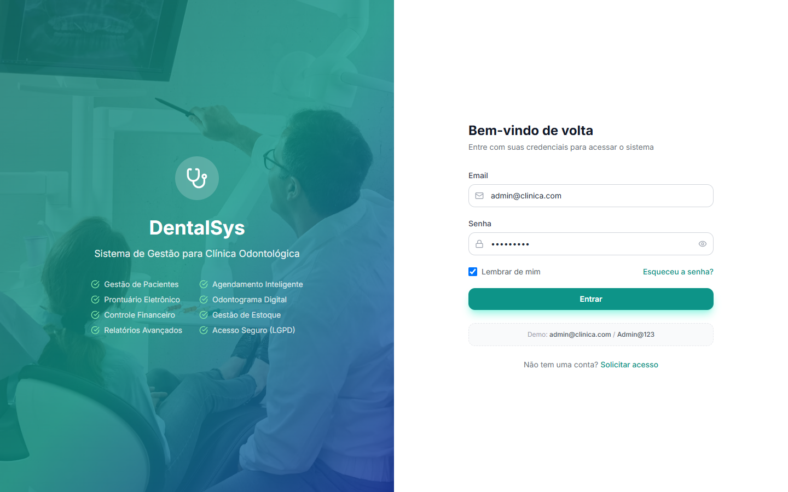

# Manual de Uso — DentalSys

Sistema de gestão para clínicas odontológicas: agenda, prontuário eletrônico, planos de tratamento, financeiro, estoque, laboratório, comunicação e relatórios.

## 1. Acesso ao Sistema

1. Abra o navegador (Chrome, Edge ou Firefox atualizados) e acesse o endereço do sistema.
2. Na tela de **Login**, informe seu **e-mail** e **senha**.
3. Marque **"Lembrar de mim"** se quiser permanecer conectado.
4. Clique em **Entrar**.

> **Credenciais padrão de demonstração:**
> - E-mail: `admin@clinica.com`
> - Senha: `Admin@123`

Se o e-mail ou senha estiverem incorretos, aparece a mensagem **"Email ou senha incorretos"**. Se a clínica usa **2FA**, será solicitado o código de autenticação após o login.

**Sair do sistema:** clique no botão ⏻ no rodapé da barra lateral esquerda.

**Trocar tema:** o sistema funciona em **modo claro** e **modo escuro**. O tema pode ser trocado pelo botão no cabeçalho ou em **Configurações → Aparência**.

## 2. Visão Geral da Interface

- **Barra lateral esquerda:** navegação organizada em categorias (GERAL, ATENDIMENTO, FINANCEIRO, OPERAÇÃO, ADMINISTRAÇÃO). Clique no nome da categoria para expandir/recolher. A categoria do link ativo abre automaticamente.
- **Cabeçalho:** acesso rápido ao tema e ao perfil.
- **Rodapé da barra lateral:** seu nome, perfil (ADMIN, DENTIST, RECEPTIONIST, etc.) e botão de sair.

> Os itens do menu variam conforme o **perfil do usuário**. Um recepcionista, por exemplo, não vê "Usuários" ou "Migração".

### Perfis e principais permissões

| Perfil | Acesso principal |
|--------|------------------|
| **ADMIN** | Todas as telas e módulos |
| **DENTIST** | Dashboard, Notificações, Pacientes, Agendamentos, Prontuário, Convênios, Lab, Procedimentos, Profissionais |
| **ASSISTANT** | Dashboard, Pacientes, Agendamentos, Lab, Estoque, Procedimentos, Salas, Profissionais |
| **RECEPTIONIST** | Dashboard, Pacientes, Agendamentos, Agenda, Financeiro, Pagamentos, Convênios, Procedimentos, Salas, Profissionais |
| **FINANCIAL** | Dashboard, Financeiro, Fluxo de Caixa, Pagamentos, Comissões, Relatórios, Convênios, NF-e |

## 3. Sumário por Módulo

| Módulo | Arquivo |
|--------|---------|
| Dashboard | [01-dashboard.md](01-dashboard.md) |
| Pacientes e Anamnese | [02-pacientes.md](02-pacientes.md) |
| Agendamentos e Agenda | [03-agendamentos.md](03-agendamentos.md) |
| Prontuário e Odontograma | [04-prontuario.md](04-prontuario.md) |
| Planos de Tratamento | [05-planos.md](05-planos.md) |
| Financeiro | [06-financeiro.md](06-financeiro.md) |
| Operação (Lab, Estoque, etc.) | [07-operacao.md](07-operacao.md) |
| Administração | [08-administracao.md](08-administracao.md) |
| Relatórios | [09-relatorios.md](09-relatorios.md) |
| Notificações | [10-notificacoes.md](10-notificacoes.md) |
| Agendamento Online | [11-agendamento-online.md](11-agendamento-online.md) |
| Dicas e Solução de Problemas | [12-dicas.md](12-dicas.md) |
