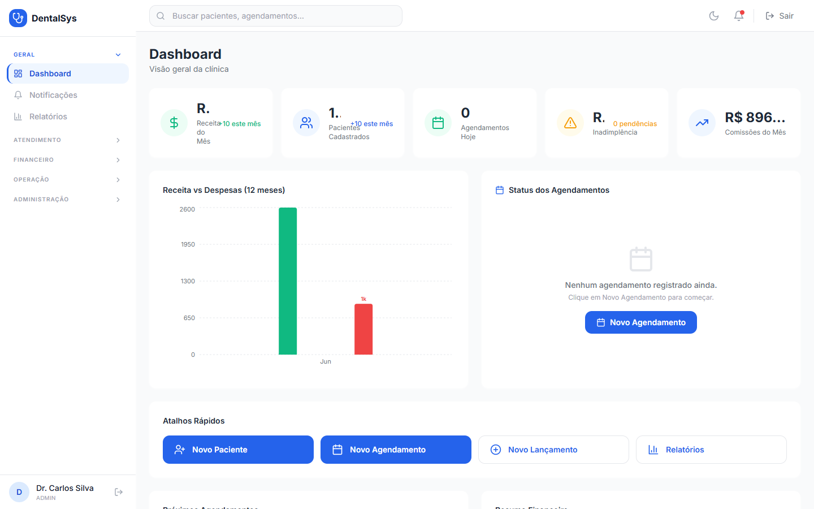

# 1. Dashboard (Painel Inicial)

Ao entrar, você vê o resumo da clínica:

- **Receita do Mês** e **Lucro Líquido**
- **Pacientes cadastrados**
- **Agendamentos de hoje**
- **Inadimplência** e **Comissões do Mês**
- Gráfico de **Receitas vs Despesas** dos últimos 12 meses
- **Próximos atendimentos** e status dos agendamentos do dia

**Atalhos rápidos:** Novo Paciente, Novo Agendamento, Novo Lançamento (financeiro) e Relatórios.
