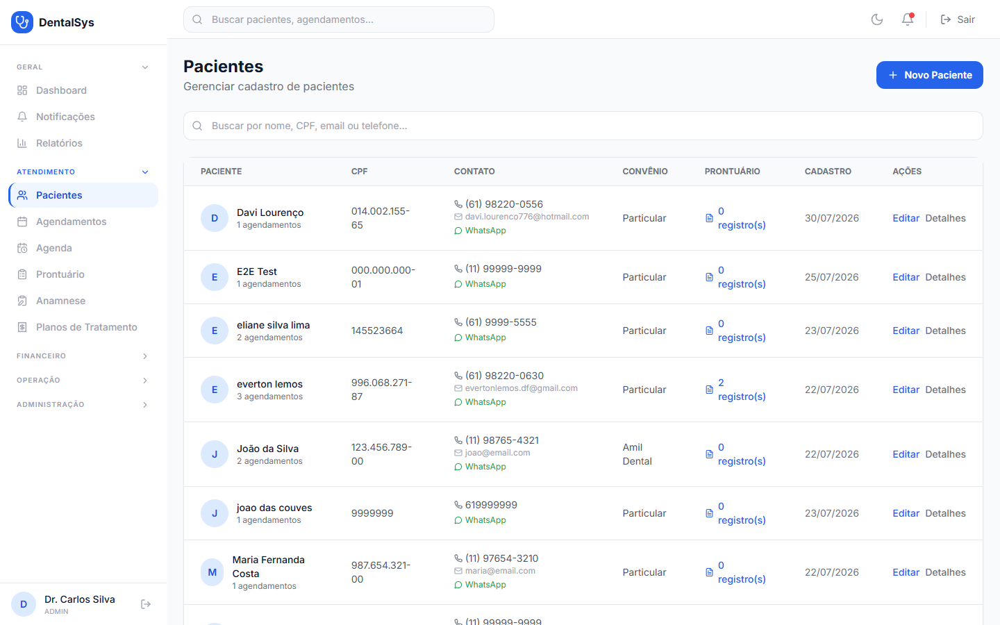
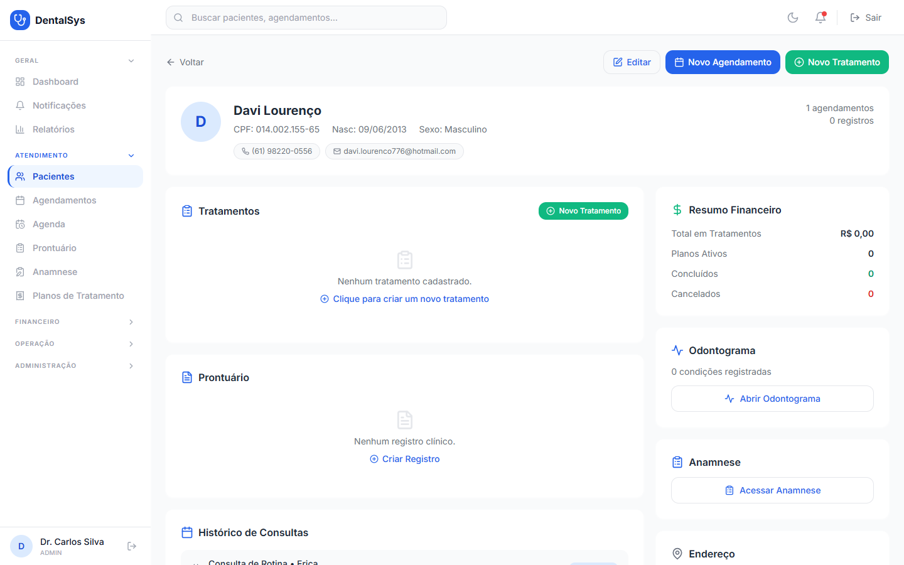
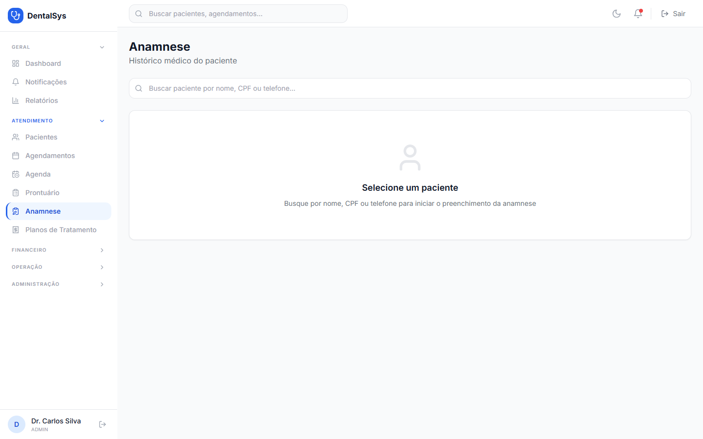

# 2. Pacientes e Anamnese

## 2.1 Cadastrar paciente

1. Menu **Pacientes** → botão **Novo Paciente**.
2. Preencha os campos (Nome é obrigatório).
3. Ao informar o **CEP**, o endereço é preenchido automaticamente (ViaCEP).
4. Clique em **Cadastrar**.

## 2.2 Buscar e editar

- Use a **caixa de busca** para localizar por nome.
- Botões na linha do paciente: **Editar**, **Detalhes**, link do **WhatsApp** e acesso ao **Prontuário**.

## 2.3 Ficha completa (Paciente Detalhes)

Reúne tratamentos, prontuário, histórico de consultas, resumo financeiro, odontograma, histórico médico, anamnese, endereço, contato de emergência e responsável legal.

A partir daqui você pode criar **Novo Agendamento**, **Novo Tratamento**, abrir o **Prontuário Completo**, o **Odontograma** ou a **Anamnese**.

## 2.4 Anamnese

1. Menu **Anamnese**.
2. Busque o paciente (nome, CPF ou telefone).
3. Preencha as seções: **Informações Pessoais, Endereço, Contato de Emergência, Histórico Médico** (alergias, doenças crônicas, medicações, cirurgias, tabagismo), **Convênio** e **Responsável Legal**.
4. Clique em **Salvar Anamnese**.

