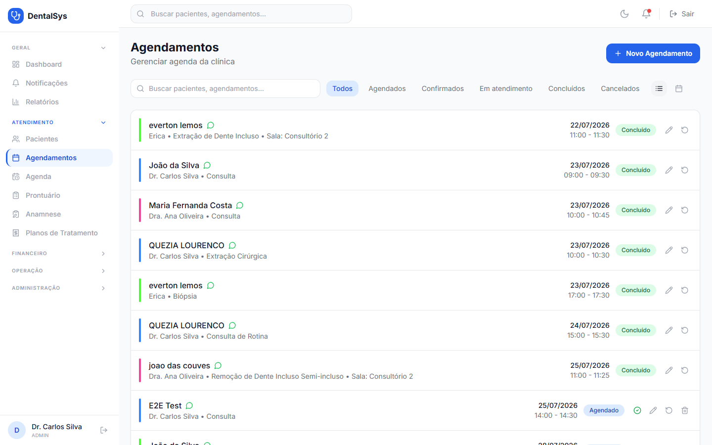
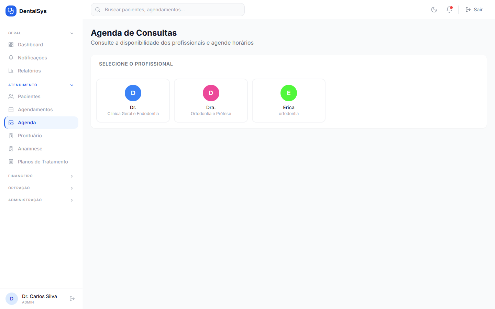

# 3. Agendamentos e Agenda

## 3.1 Criar agendamento

1. Menu **Agendamentos** → **Novo Agendamento**.
2. Selecione **Paciente** (busca com lista) e **Profissional**.
3. Defina **Data**, **Horário de início** e **fim**.
4. Opcional: **Sala**, **Procedimento** e **Observações**.
5. Clique em **Agendar**.

**Fluxo de status:** Agendado → **Confirmar** → Confirmado → **Iniciar** → Em atendimento → **Concluir** → Concluído.

**Outras ações por linha:**

- **Editar** (lápis), **Remarcar** (ícone de rotação) e **Cancelar** (lixeira).
- **Remarcar:** um aviso informa que o agendamento atual será cancelado e um novo será criado.
- **Cancelar:** confirmação com **Motivo** (opcional).
- Exibição em **Lista** ou **Calendário** mensal. No calendário, clique no **"+"** de um dia para agendar nele.

## 3.2 Agenda do dia

1. Menu **Agenda**.
2. Escolha o **profissional** (card) e a **data** (setas ‹ › para os dias).
3. O sistema mostra as **consultas do dia**, o **limite diário** do profissional e as **vagas livres**.
4. Clique em uma vaga (chip **"Livre"**) e confirme com o **paciente** e, opcionalmente, o **procedimento**.
5. **Confirmar Agendamento** cria uma consulta de 30 minutos.

> Se o limite diário for atingido, aparece o aviso amarelo **"Limite diário atingido"**.
