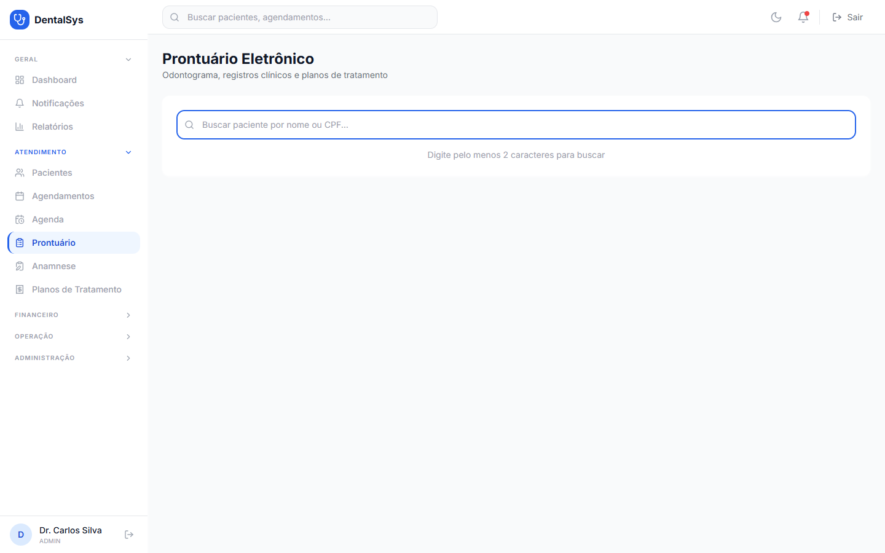

# 4. Prontuário Eletrônico

Menu **Prontuário** → busque o paciente (nome ou CPF). O prontuário tem 4 abas:

## 4.1 Visão Geral

- Última consulta, último tratamento, alergias/restrições e medicações.
- Histórico de tratamentos, prontuário clínico (últimos 5), resumo financeiro e alertas médicos.
- Ações: **WhatsApp**, **Ficha completa**, **Trocar paciente**.

## 4.2 Odontograma

1. Clique nos **dentes** (32 dentes numerados) para selecionar.
2. Escolha a **condição** (chips rápidos ou lista agrupada) e a **face** (M, D, O, V, L, etc.).
3. Opcional: **Seleção Múltipla** para aplicar em vários dentes de uma vez (**Aplicar em N dentes**).
4. **Salvar Condição** ou **Salvar e Vincular a Orçamento** (salva e abre Planos de Tratamento).
5. Para remover, use a lixeira da condição.

> Se houver alterações não salvas, o sistema avisa antes de sair.

## 4.3 Registros

- Lista de atendimentos registrados e botão **Novo Registro**.

## 4.4 Planos

- Lista de planos do paciente com status (Proposto, Aceito, Em Andamento, Concluído, Cancelado) e botão **Novo Plano**.
