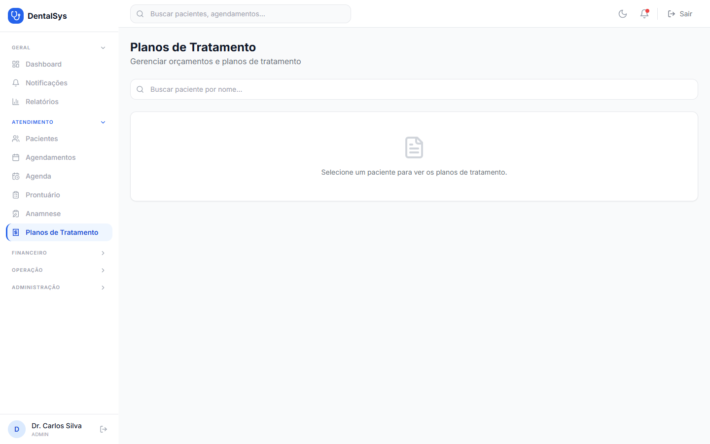

# 5. Planos de Tratamento (Orçamentos)

1. Menu **Planos de Tratamento**.
2. Selecione o **paciente** na busca.
3. Clique em **Novo Plano**.

## 5.1 Formulário do plano

- **Título*** (obrigatório, ex: "Restauração + Limpeza") e **Descrição**.
- **Paciente** (somente leitura, com idade) e **Profissional Responsável** (já pré-selecionado com o dentista logado).
- **Itens do Plano:** busque o procedimento (valores pré-cadastrados aparecem), informe **Dente** (seletor rápido de 32 dentes), **Valor Unit. (R$)**, **Qtd** e clique em **+ Adicionar**. Os subtotais e o **Valor Total** calculam automaticamente.
- **Válido até** (data de validade do orçamento) e **Observações** (condições de pagamento, etc.).

## 5.2 Acompanhamento do plano

- **Aceitar** (gera o lançamento financeiro automaticamente), **Iniciar**, **Concluir** ou **Cancelar**.
- O botão **Imprimir** gera uma versão para impressão.

> Ao fechar o modal com alterações não salvas, aparece o aviso **"Alterações não salvas"** com opções **Continuar Editando** ou **Descartar**.
