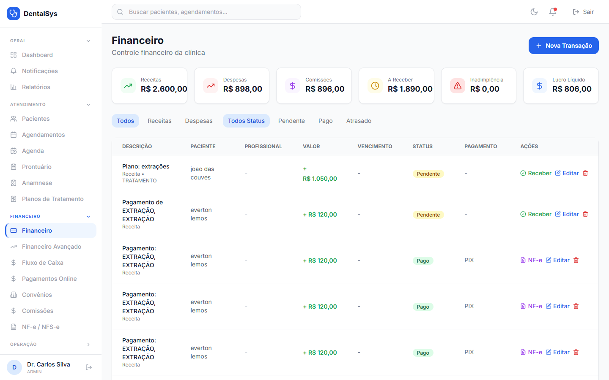
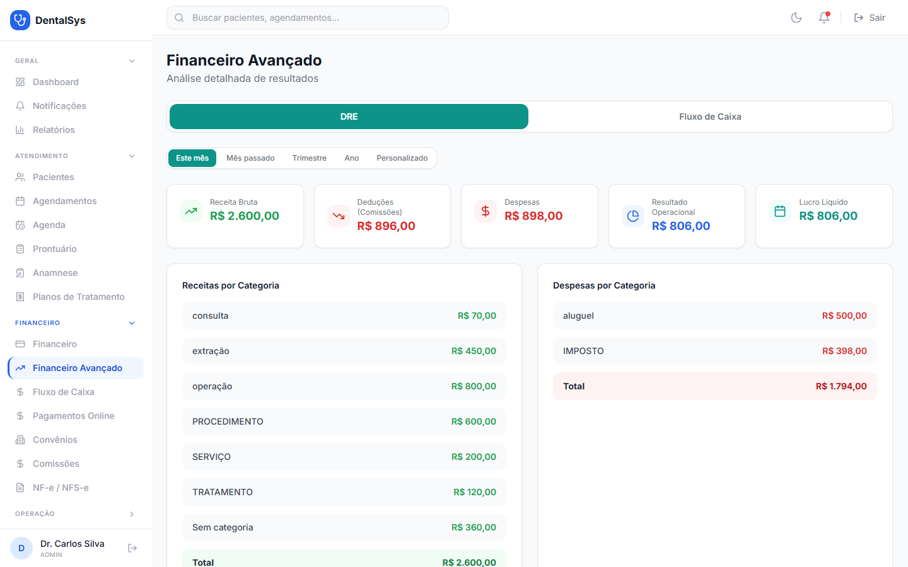
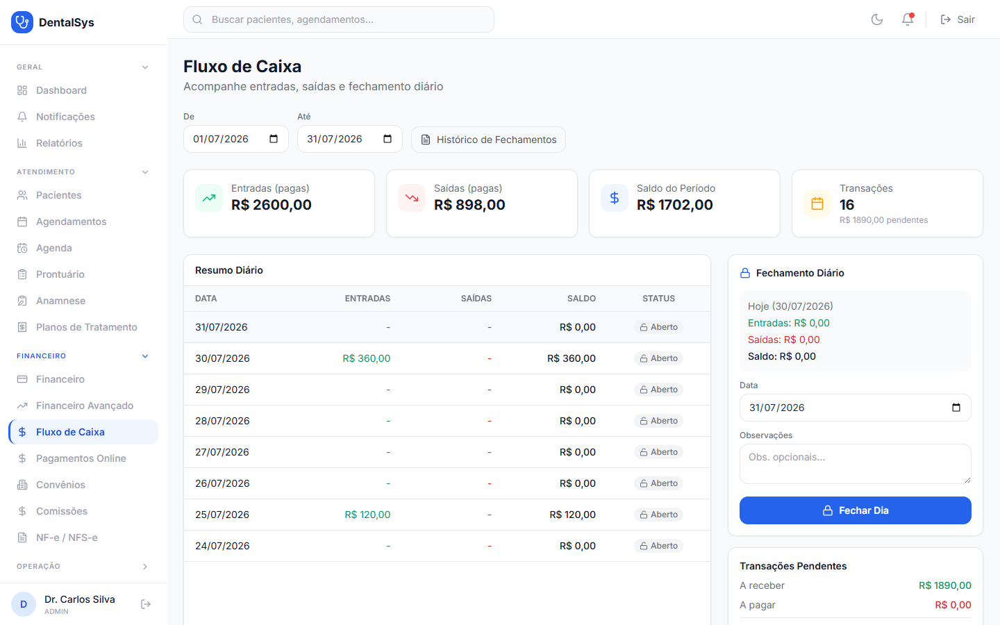
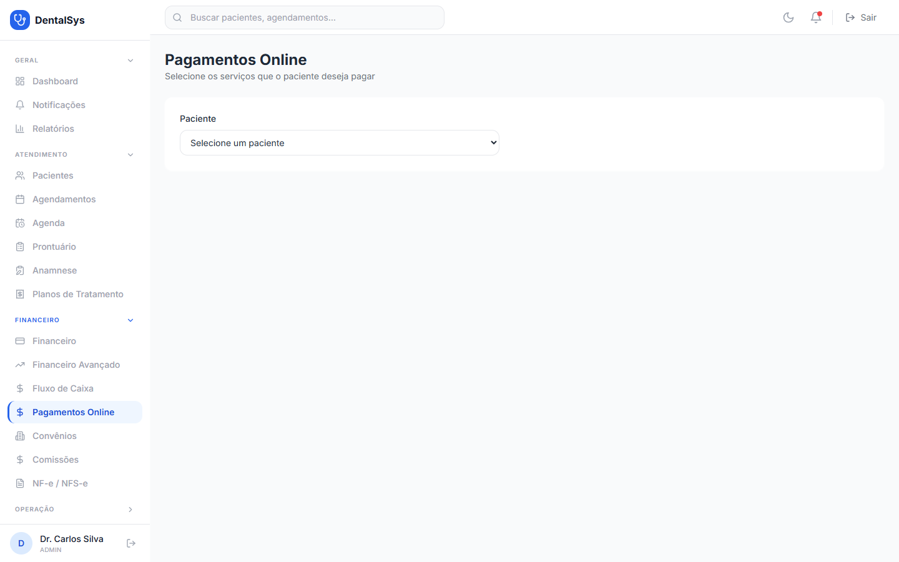
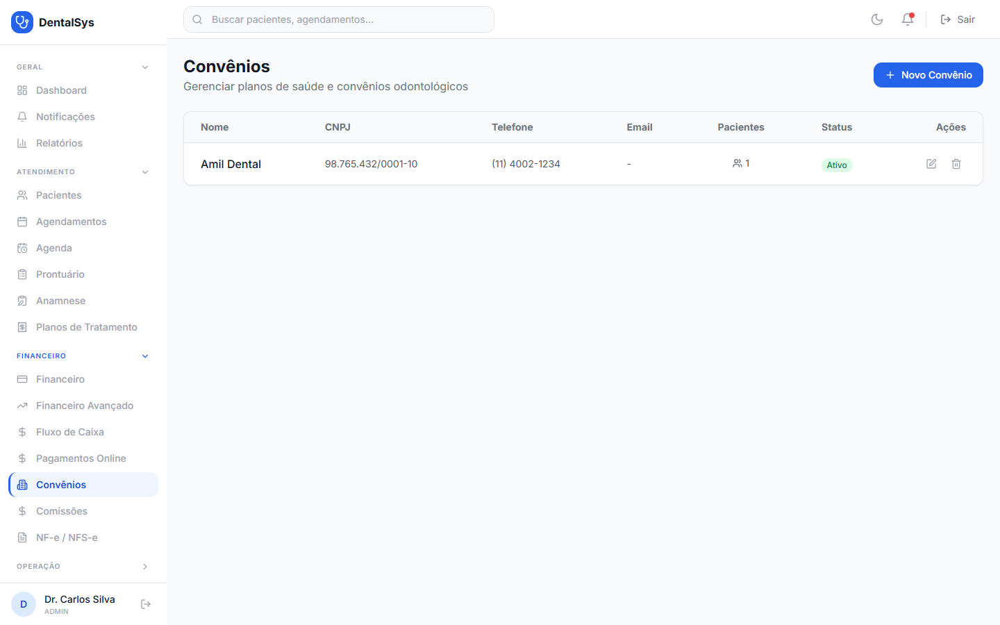
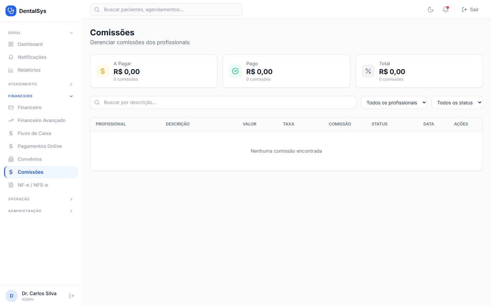
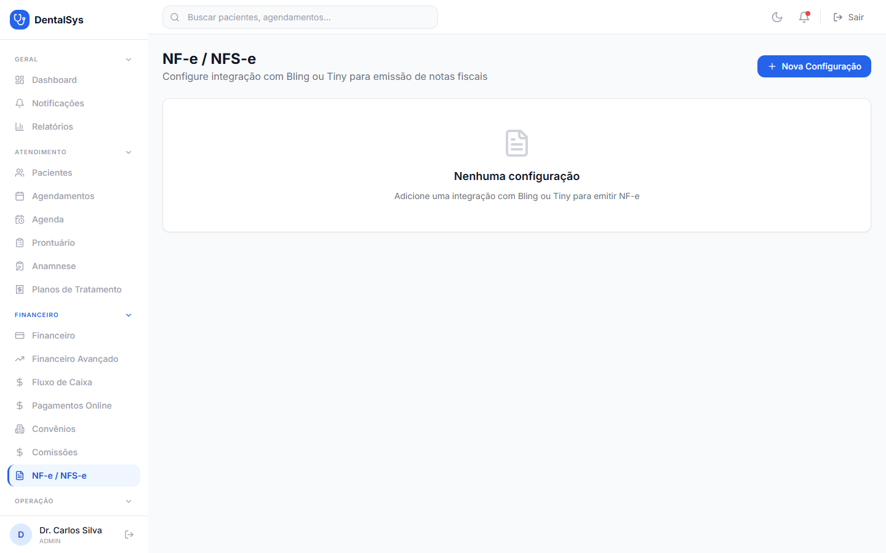

# 6. Financeiro

## 6.1 Financeiro (Transações)

**Nova transação:**
1. Menu **Financeiro** → **Nova Transação**.
2. Informe **Tipo** (Receita/Despesa), **Categoria**, **Descrição*** e **Valor (R$)**.
3. Opcional: **Paciente**, **Profissional Responsável** (necessário para cálculo de comissão), **Data de Vencimento** e **Forma de Pagamento**.
4. Para **Cartão de Crédito**, defina o número de **Parcelas** (1 a 12) com prévia de cada parcela.
5. **Criar Transação**.

**Receber uma conta:** clique em **Receber** na linha da transação e confirme a **Forma de Pagamento** e o **Profissional** → **Confirmar Recebimento**.

**Emitir NF-e:** em transações **Pagas**, use o botão **NF-e** (confirmação e número gerado).

> Exclusão de transação é permitida apenas para **ADMIN**.

## 6.2 Financeiro Avançado (DRE)

Menu **Financeiro Avançado**:
- Aba **DRE**: Receita Bruta, Deduções (Comissões), Despesas, Resultado Operacional e Lucro Líquido, com gráficos por categoria.
- Aba **Fluxo de Caixa**: receitas vs despesas mensais e saldo.
- Selecione o período: **Este mês, Mês passado, Trimestre, Ano ou Personalizado**.

## 6.3 Fluxo de Caixa

1. Defina o período (**De** / **Até**).
2. Veja **Entradas, Saídas, Saldo do Período** e a tabela **Resumo Diário** (dias abertos/fechados).
3. Para **fechar o dia**: no painel **Fechamento Diário**, escolha a data e, se quiser, uma **Observação**, e clique em **Fechar Dia**.
4. **Histórico de Fechamentos** mostra os fechamentos já realizados.
5. A seção **Transações Pendentes** informa o que ainda está **A receber** e **A pagar**.

## 6.4 Pagamentos Online

Menu **Pagamentos Online** (Mercado Pago / Stripe):
1. Selecione o **paciente** (obrigatório) e o **CPF** (obrigatório para PIX/Boleto).
2. Marque os **itens pendentes** do plano de tratamento (ou **Selecionar todos**).
3. Escolha a forma: **Checkout Pro**, **PIX** ou **Boleto** (Mercado Pago) ou **Pagar com Stripe**.
4. **PIX:** exibe QR Code e código "copia e cola" para copiar. **Boleto:** link para visualizar e código de barras.

> Para usar os pagamentos, o **ADMIN** precisa configurar o token do Mercado Pago (Configurações → Mercado Pago).

## 6.5 Convênios

Menu **Convênios**: cadastre e edite os convênios da clínica. Eles aparecem no cadastro do paciente e em procedimentos.

## 6.6 Comissões

Menu **Comissões**:
- Cards de resumo: **A Pagar, Pago, Total**.
- Filtros por **descrição, profissional e status**.
- Nas comissões **Pendentes**: pagar (✔) ou cancelar (⛔).
- Comissões são geradas a partir do faturamento vinculado ao profissional.

## 6.7 NF-e / NFS-e

Menu **NF-e/NFS-e**:
1. **Nova Configuração** — escolha o provedor (**Bling** ou **Tiny**), informe **API Key/Token** (obrigatório), **API URL** (opcional), **Série** e **Ambiente** (Produção/Teste).
2. **Salvar**. As configurações aparecem como cards com status Ativo/Inativo e ambiente.
3. A emissão em si é feita pelo botão **NF-e** nas transações pagas (seção 6.1).
