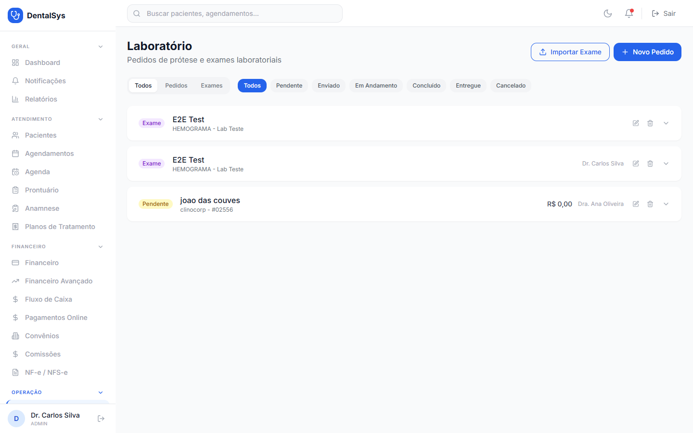
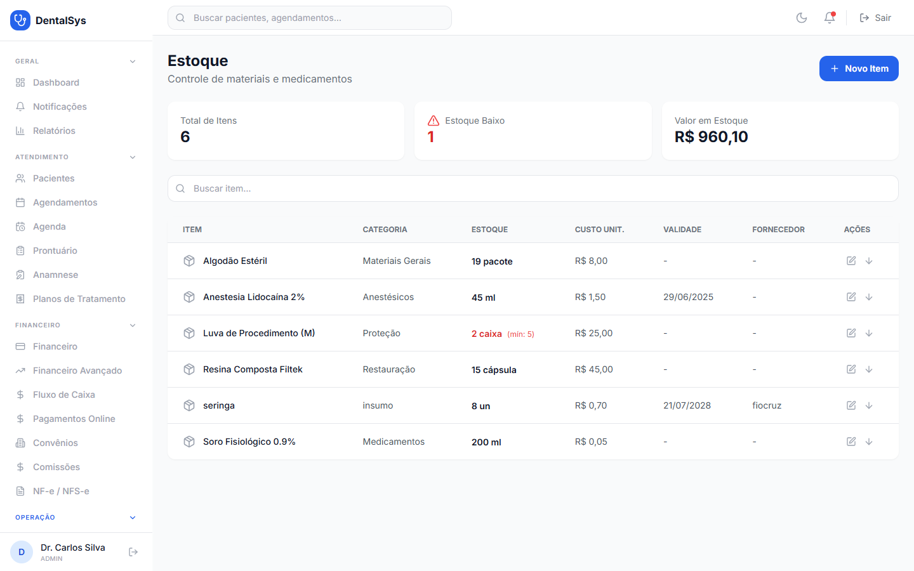
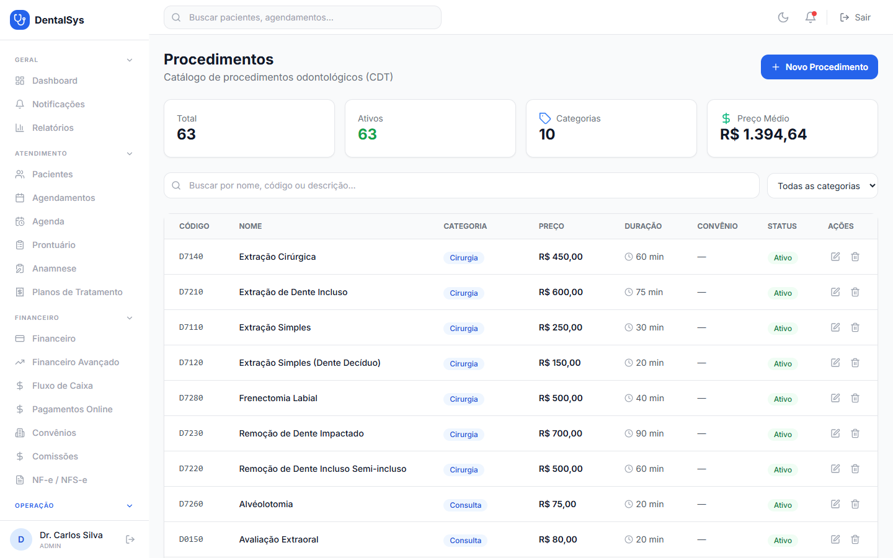
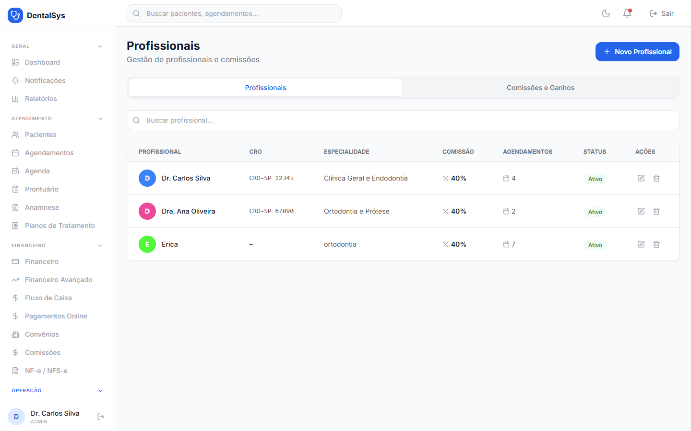
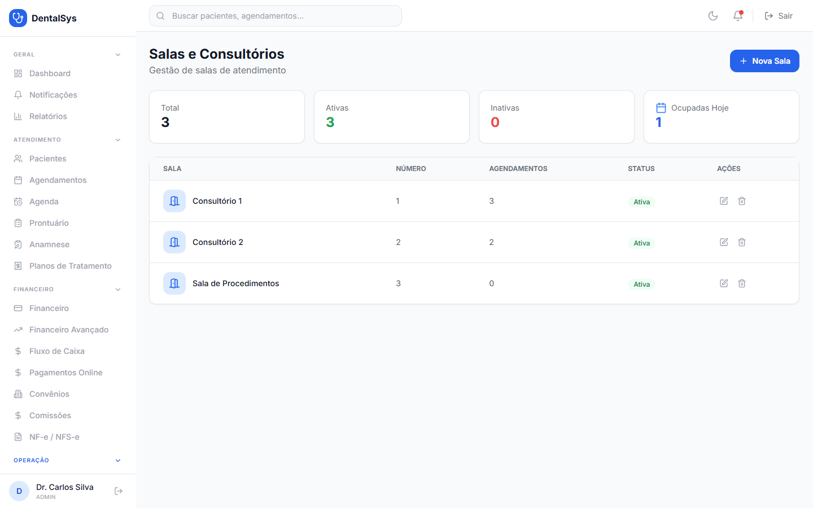

# 7. Operação

## 7.1 Laboratório

Menu **Laboratório**:
- **Novo Pedido:** paciente, profissional, laboratório, contato, nº do pedido, data de entrega e **Itens** dinâmicos (descrição, dente, material, cor, qtd, valor unit.). Use **+ Adicionar item** para incluir vários.
- **Importar Exame:** paciente, tipo de exame, laboratório, data e arquivo (PDF ou imagem).
- Filtros por tipo (Pedidos/Exames) e status (Pendente, Enviado, Em Andamento, Concluído, Entregue, Cancelado).

## 7.2 Estoque

Menu **Estoque**:
1. **Novo Item:** nome, categoria, SKU, unidade (un, kg, g, l, ml, cx, pct), estoque atual/mínimo, custo unitário, preço de venda, validade, fornecedor e descrição.
2. **Movimentar Estoque** (seta na linha do item): tipo de movimentação (**Entrada, Saída, Ajuste, Devolução**), quantidade e, para entradas, custo e nº da nota fiscal.
3. Itens com estoque abaixo do mínimo ficam **em vermelho** com o aviso "(mín: X)".

## 7.3 Procedimentos

Menu **Procedimentos**: cadastro com código/CDT, nome, descrição, categoria, **valor padrão**, **preço convênio**, **duração** e se exige autorização.

## 7.4 Profissionais

Menu **Profissionais**:
- Cadastro com nome, CRO, especialidade, cor e **% de comissão** (usado no cálculo das comissões).
- Aba **Comissões**: resumo por profissional com receita, comissão, atendimentos e detalhamento por dia/mês.

## 7.5 Salas

Menu **Salas**: cadastre as salas/consultórios e associe-as aos agendamentos.
