# 8. Administração

## 8.1 Usuários

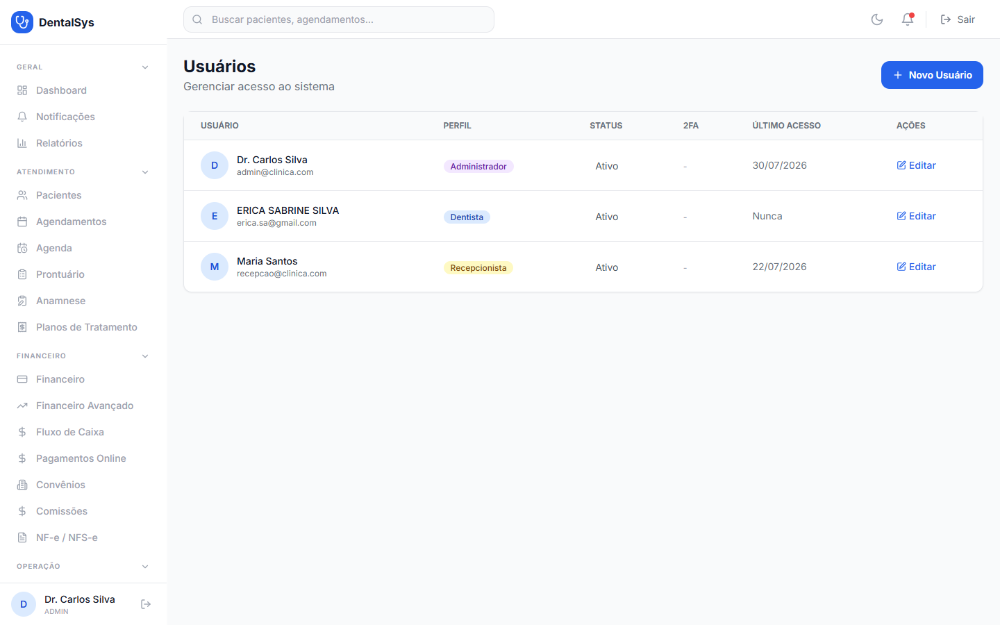

Menu **Usuários**:
1. **Novo Usuário:** nome*, e-mail*, senha* (mín. 8 caracteres), **Perfil** (Administrador, Dentista, Assistente, Recepcionista, Financeiro), telefone e **Máx. Consultas/Dia** (apenas Dentista).
2. **Editar:** altera perfil, telefone, senha (opcional) e **Ativo**.
3. O e-mail não pode ser alterado após a criação.

## 8.2 Recall / Campanhas

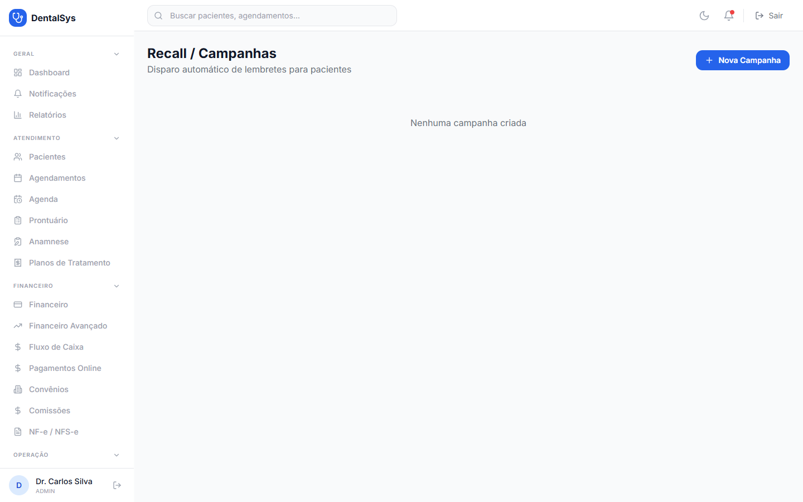

Menu **Recall**:
1. **Nova Campanha:** nome*, **Tipo** (Ausência prolongada, Aniversário, Tratamento incompleto, Personalizada), **Canal** (WhatsApp, SMS, E-mail) e **Mensagem*** — use `{{nome}}` para personalizar.
2. Para tipo **Ausência prolongada**, informe **Meses sem consulta**.
3. **Criar Campanha**.
4. Em cada campanha: **ativar/desativar**, **executar agora** (▶), **ver logs** (👁) e **excluir** (🗑).

## 8.3 IA / Transcrição

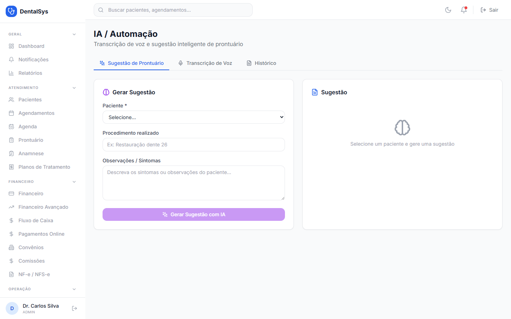

Menu **IA**:
- **Sugestão de Prontuário:** paciente, procedimento realizado e observações → **Gerar Sugestão com IA**. O resultado aparece em campos editáveis (Diagnóstico, Procedimento, Prescrição, Observações) e pode ser **Salvo no Prontuário**.
- **Transcrição de Voz:** informe a **URL pública do áudio** (MP3/WAV/M4A/OGG) → **Transcrever Áudio**.
- Aba **Histórico** com transcrições e sugestões anteriores.

## 8.4 LGPD / Privacidade

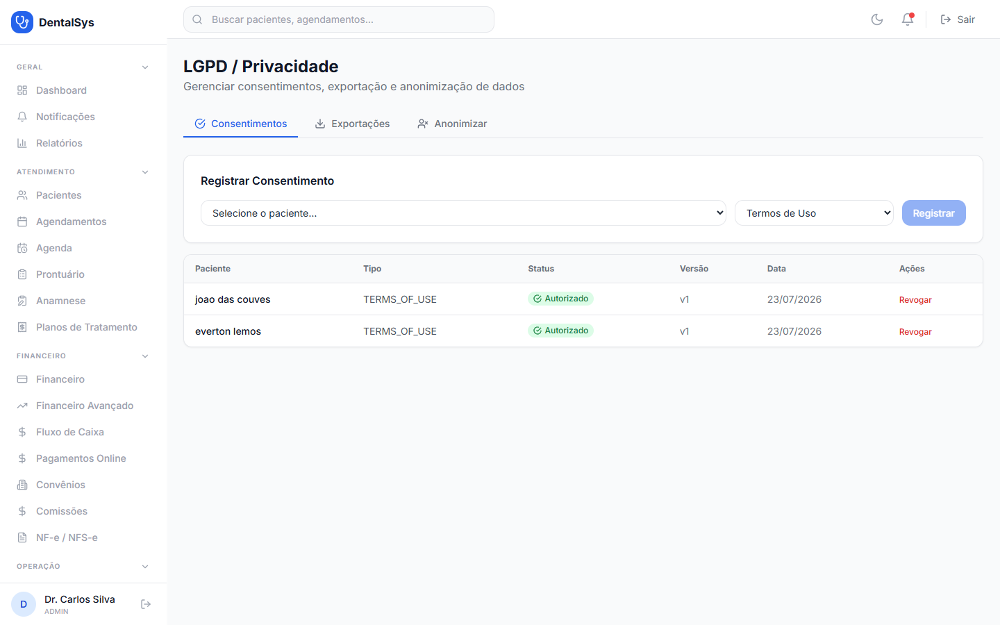

Menu **LGPD/Privacidade**:
- **Consentimentos:** registre o consentimento do paciente (Termos de Uso, Política de Privacidade, Marketing, etc.) e **Revogue** quando necessário.
- **Exportações:** solicite a **exportação** dos dados de um paciente.
- **Anonimizar:** remove identificação do paciente de forma **irreversível** (confirmação obrigatória: "TEM CERTEZA?").

## 8.5 Migração

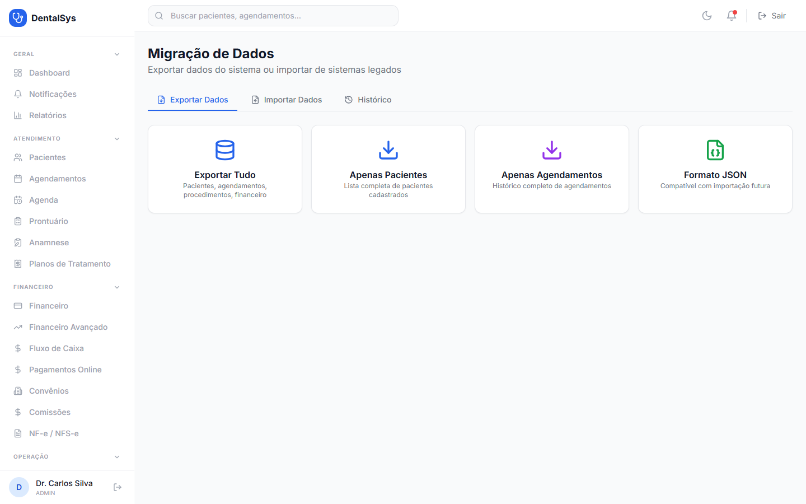

Menu **Migração**:
- **Exportar Dados:** tudo, apenas pacientes ou apenas agendamentos (arquivo JSON).
- **Importar Dados:** tipo (Pacientes/Procedimentos) e arquivo JSON → **Importar**. Um resumo mostra "X de Y registros importados" e eventuais erros.
- **Histórico:** registro de todas as importações/exportações.

## 8.6 Configurações

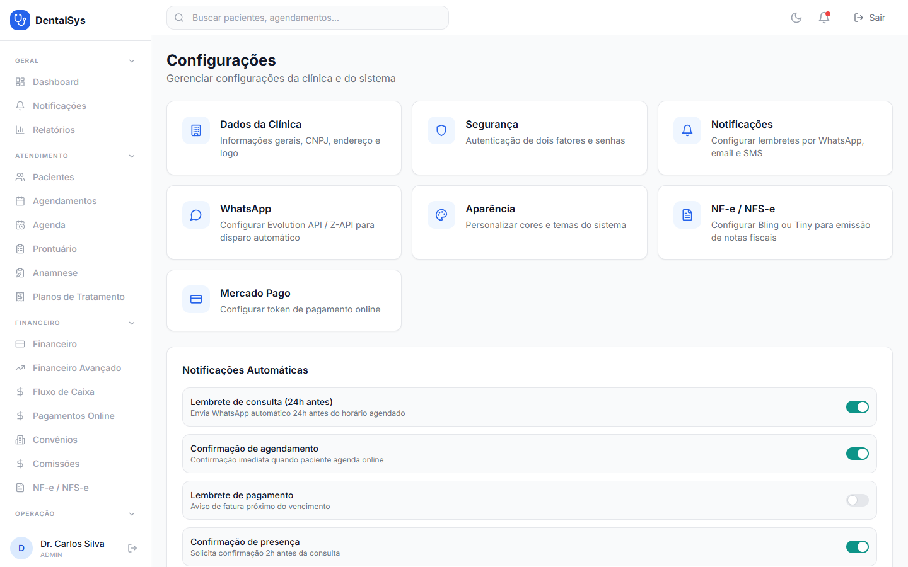

Menu **Configurações** (acesso ADMIN):

**Dados da Clínica** — nome fantasia*, razão social, CNPJ, e-mail, telefone e endereço → **Salvar**.

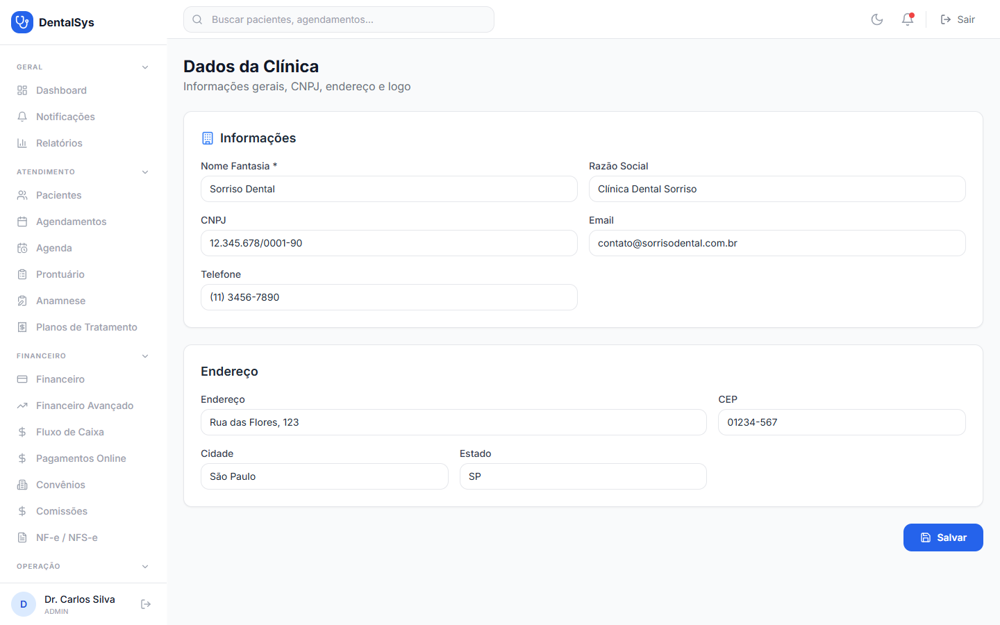

**Segurança** — alteração de senha (atual, nova, confirmar) e configuração de **2FA**.

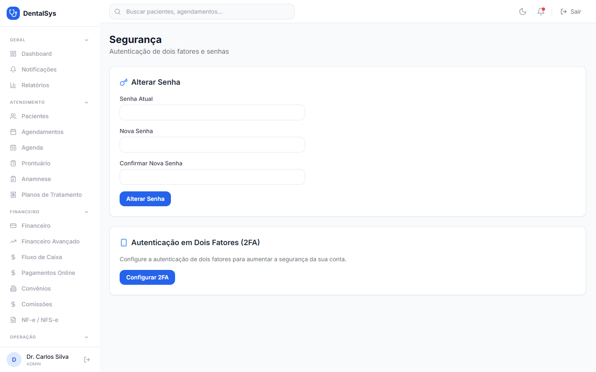

**Notificações** — ligue/desligue os lembretes automáticos (consulta 24h antes, confirmação de agendamento, lembrete de pagamento, confirmação de presença) → **Salvar**.

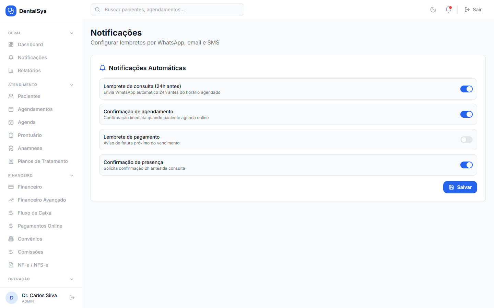

**WhatsApp** — provedor (**Evolution API** ou **Z-API**), URL da API*, chave da API* e nome da instância* → **Salvar**.

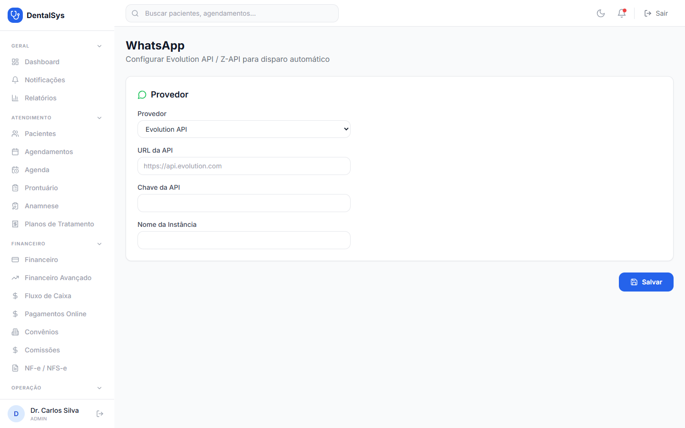

**Aparência** — **Modo Escuro**, **cor primária** e **cor da sidebar** → **Salvar**.

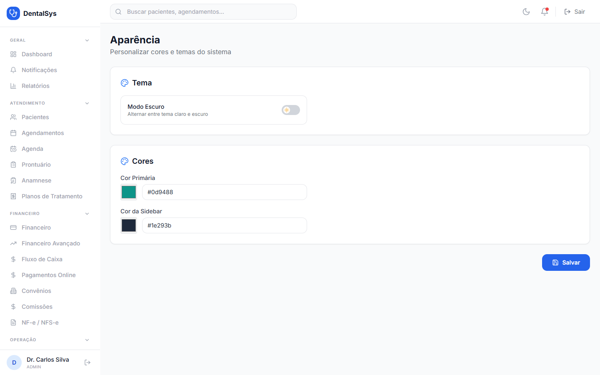

**Mercado Pago** — **Access Token** da sua conta → **Salvar** e **Verificar token**. O guia "Como configurar" explica o passo a passo na própria tela.

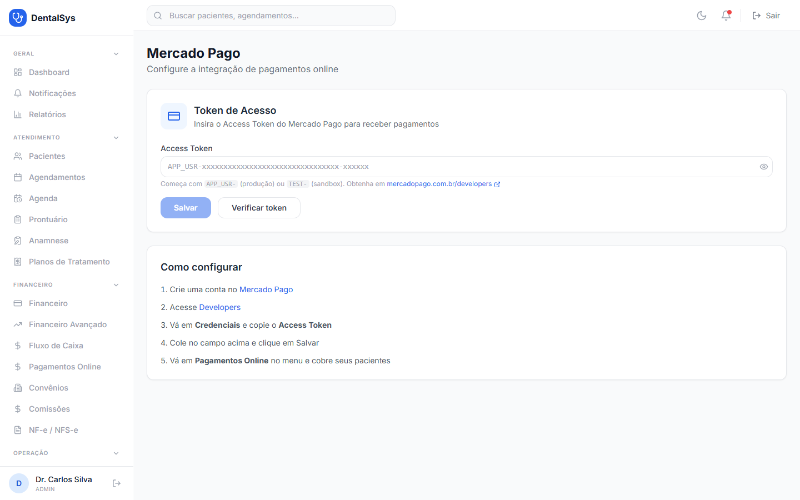
