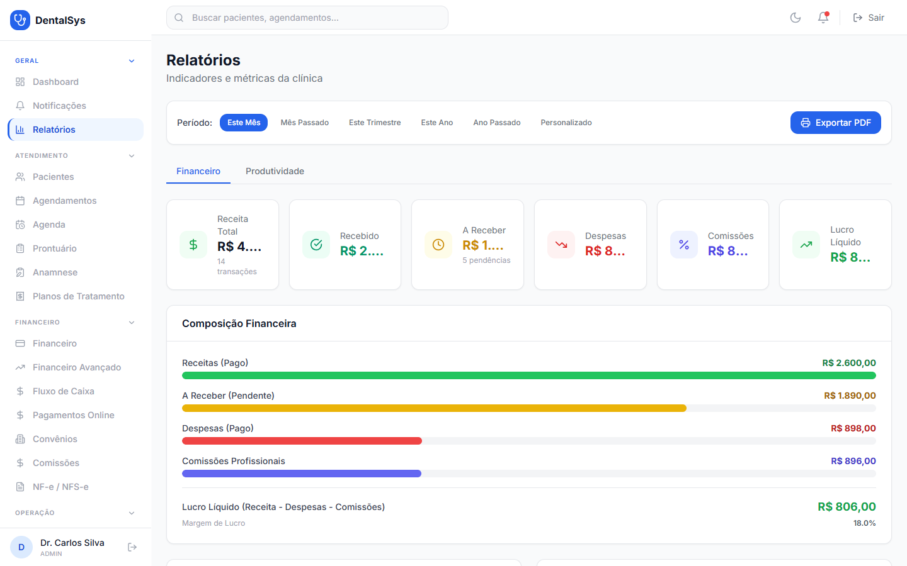

# 9. Relatórios

Menu **Relatórios**:

- Período: **Este Mês, Mês Passado, Este Trimestre, Este Ano, Ano Passado ou Personalizado**.

**Aba Financeiro:**
- Receita total, recebido, a receber, despesas, comissões, lucro líquido.
- Composição financeira, ocupação, formas de pagamento.
- **Inadimplência por faixa** (30/60/90 dias).
- Desempenho por profissional e procedimentos mais realizados.

**Aba Produtividade:**
- Agendados, atendidos, falhas e **aproveitamento %** por profissional e por dia.

**Exportar PDF:** gera e baixa o relatório no período selecionado.
