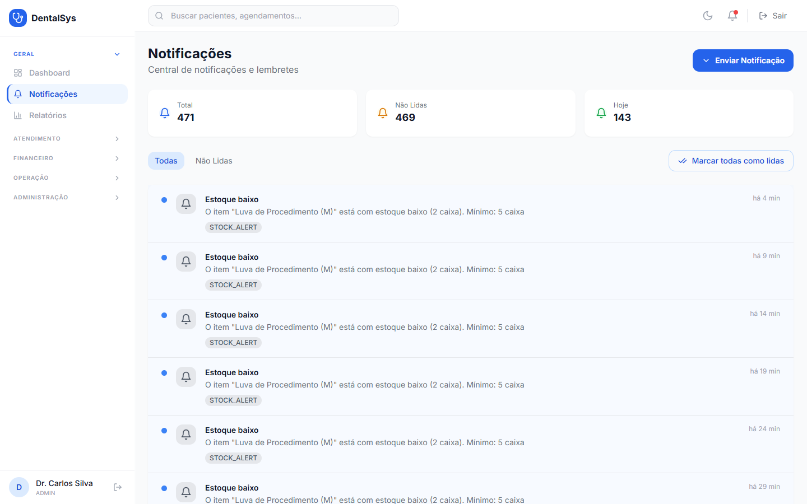

# 10. Notificações

Menu **Notificações**:

- Resumo: **Total, Não Lidas, Hoje**.
- Filtros **Todas / Não Lidas** e **Marcar todas como lidas**.
- Notificações de confirmação de consulta, lembrete, pagamento pendente/recebido e sistema (WhatsApp/E-mail/SMS).
- **Enviar Notificação:** painel manual usando **ID do Agendamento** ou **ID da Transação** para enviar confirmação, lembrete ou lembrete de pagamento.
