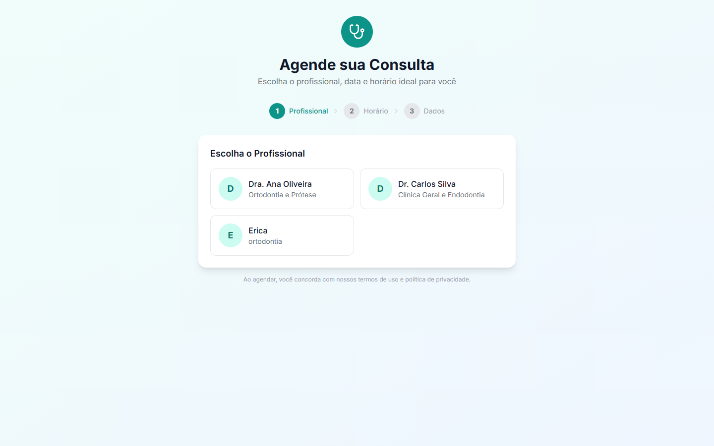

# 11. Agendamento Online

Página pública (não requer login) com fluxo em 3 etapas:

1. Escolha o **profissional**.
2. Escolha a **data** e o **horário** livre.
3. Informe **Nome completo*** e **Telefone (WhatsApp)*** → **Confirmar Agendamento**.

Ao concluir, aparece a tela **"Agendamento Confirmado!"**.
